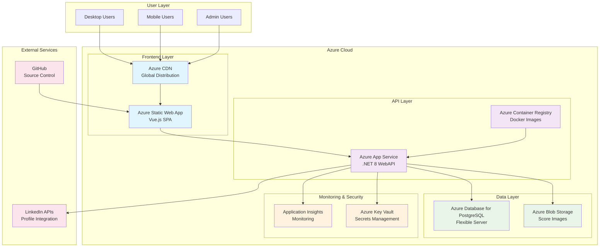
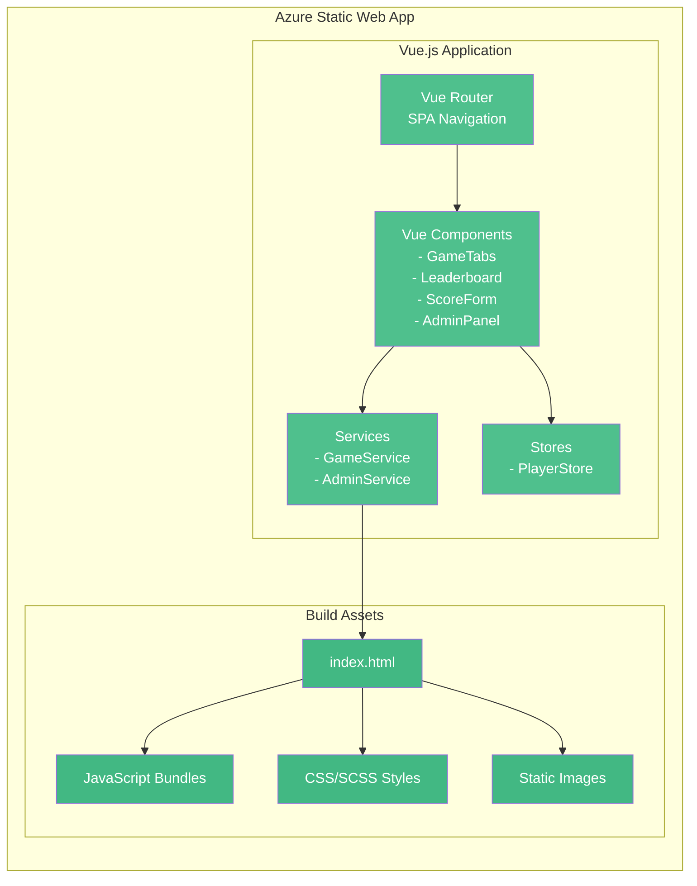
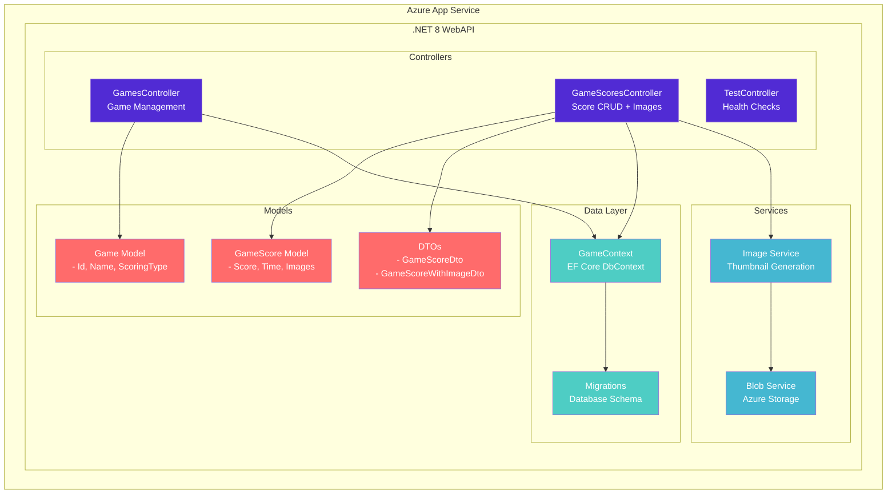
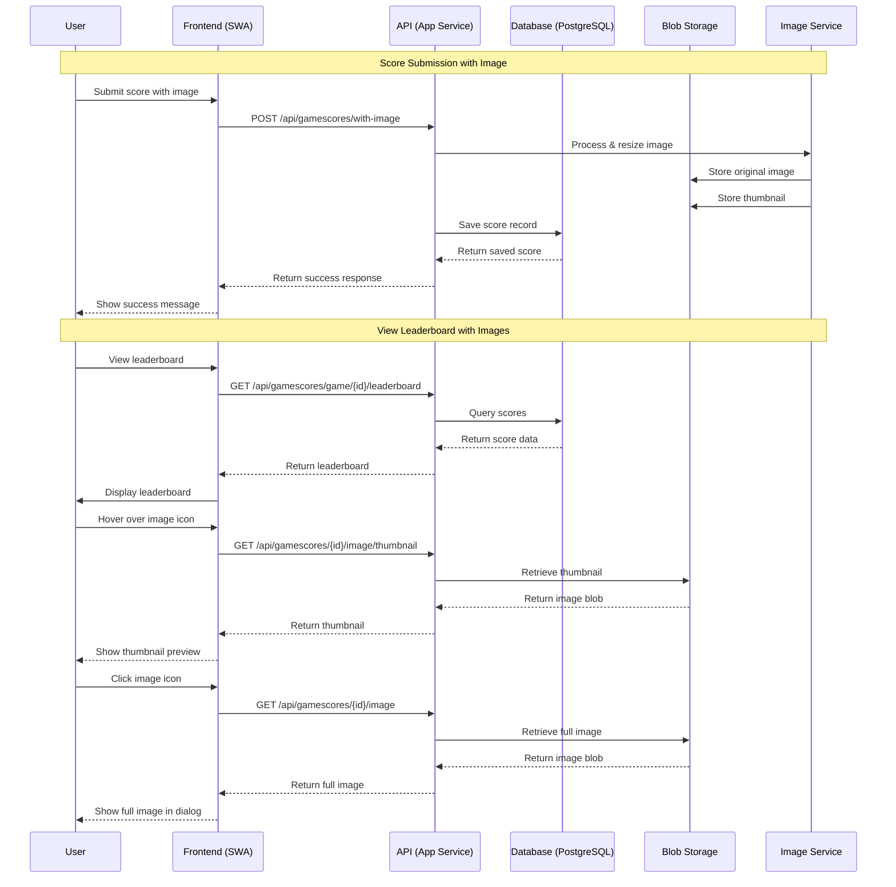
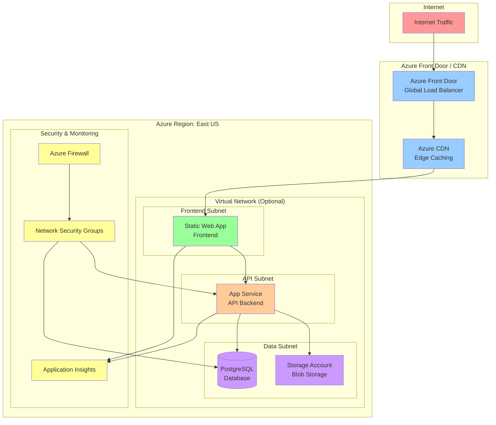
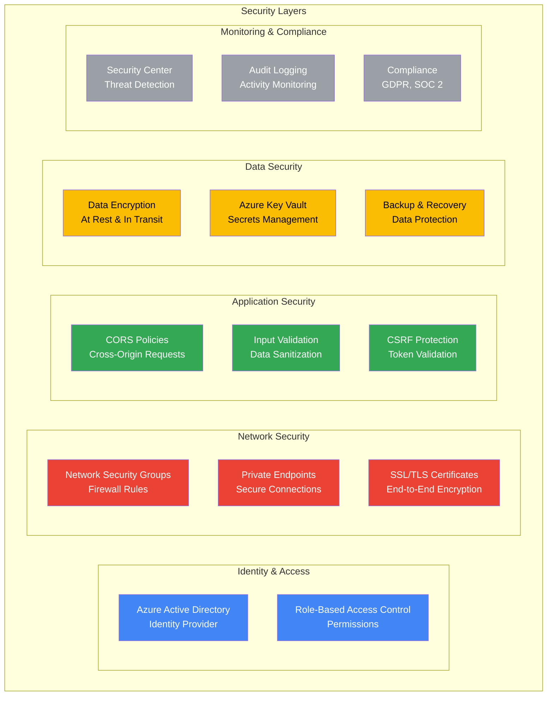
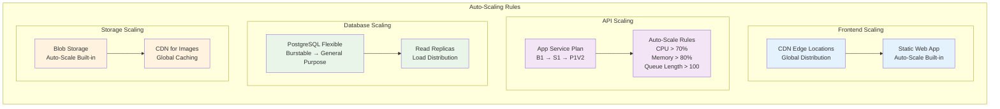
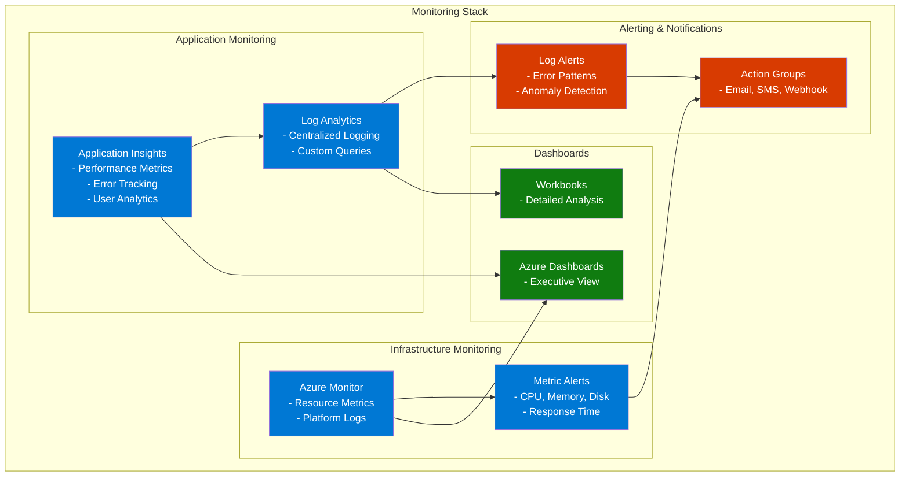

# Azure Architecture Overview

## High-Level Architecture



## Detailed Component Architecture

### Frontend Layer



### Backend Layer



### Data Flow Architecture



## Network Architecture



## Security Architecture



## Scalability & Performance

### Auto-Scaling Configuration



## Cost Optimization Strategy

| Service | Development | Production | Optimization Notes |
|---------|-------------|------------|-------------------|
| App Service Plan | B1 Basic | S1 Standard | Auto-scale based on demand |
| PostgreSQL | Burstable B1ms | General Purpose GP_Standard_D2s_v3 | Scale up during peak hours |
| Storage Account | LRS | GRS | Use lifecycle policies |
| Static Web App | Free | Standard | Pay per usage |
| Application Insights | Basic | Standard | Set retention policies |

## Monitoring & Alerting



## Disaster Recovery Plan

```mermaid
graph TB
    subgraph "Primary Region: East US"
        P_SWA[Static Web App]
        P_AS[App Service]
        P_PG[PostgreSQL Primary]
        P_BS[Blob Storage Primary]
    end
    
    subgraph "Secondary Region: West US 2"
        S_SWA[Static Web App Backup]
        S_AS[App Service Backup]
        S_PG[PostgreSQL Replica]
        S_BS[Blob Storage Backup]
    end
    
    subgraph "Backup Strategy"
        DB_BU[Daily DB Backups<br/>30-day retention]
        BLOB_BU[Blob Replication<br/>GRS Storage]
        CODE_BU[GitHub Repository<br/>Source Control]
    end

    P_PG -.->|Replication| S_PG
    P_BS -.->|GRS Replication| S_BS
    P_SWA -.->|GitHub Actions| S_SWA
    
    P_PG --> DB_BU
    P_BS --> BLOB_BU
    P_AS --> CODE_BU

    classDef primary fill:#107c10,color:#fff
    classDef secondary fill:#d83b01,color:#fff
    classDef backup fill:#0078d4,color:#fff

    class P_SWA,P_AS,P_PG,P_BS primary
    class S_SWA,S_AS,S_PG,S_BS secondary  
    class DB_BU,BLOB_BU,CODE_BU backup
```

---

## Next Steps

1. **Review the [Main Deployment Guide](./README.md)** for step-by-step instructions
2. **Check the [Troubleshooting Guide](./Troubleshooting.md)** for common issues
3. **Follow the [CI/CD Setup Guide](./CICD.md)** for automated deployments