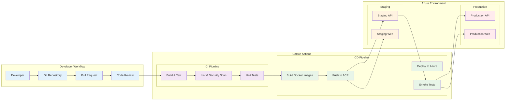
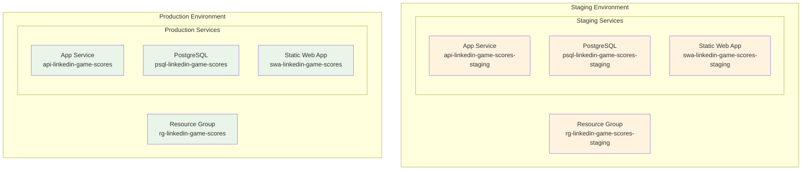
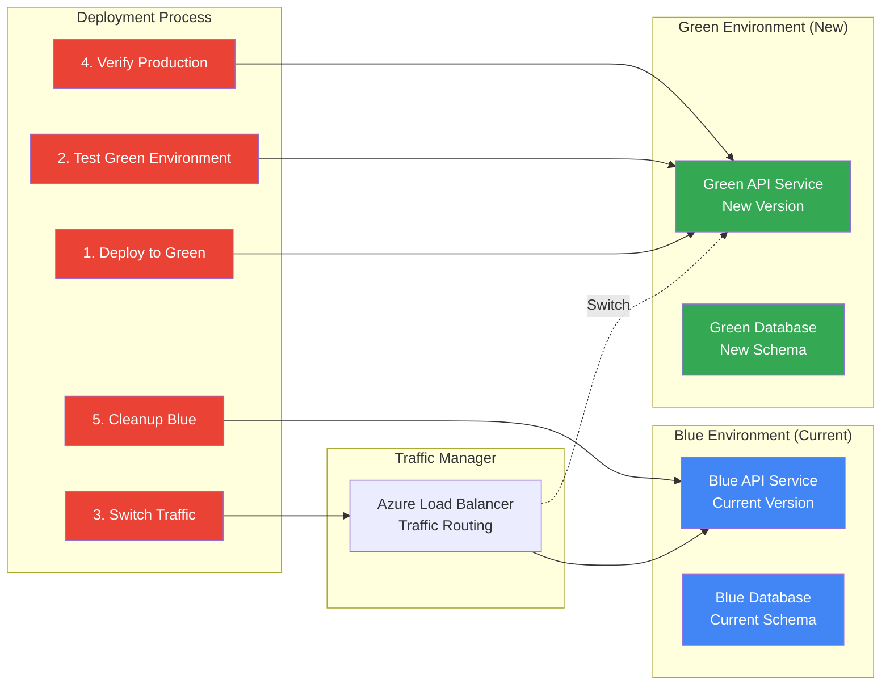
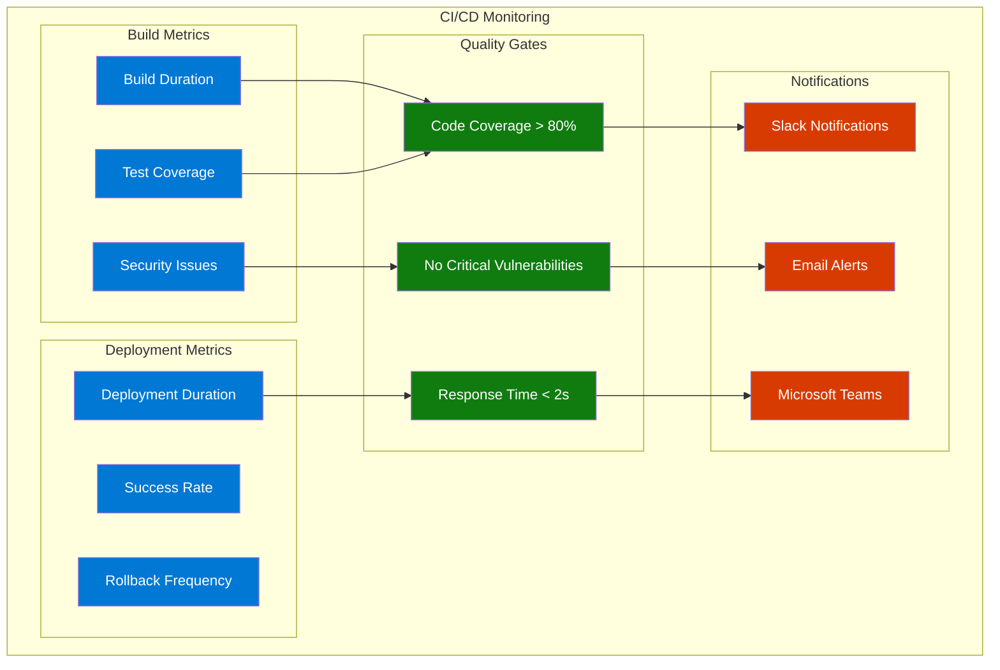

# CI/CD Deployment Workflow

## Overview

This guide sets up automated deployment pipelines using GitHub Actions for continuous integration and deployment (CI/CD) to Azure.

## Workflow Architecture



## GitHub Actions Setup

### 1. Create GitHub Secrets

First, add these secrets to your GitHub repository:

```bash
# Azure Service Principal (for authentication)
AZURE_CLIENT_ID
AZURE_CLIENT_SECRET
AZURE_SUBSCRIPTION_ID
AZURE_TENANT_ID

# Azure Container Registry
ACR_NAME=acrlinkedingamescores
ACR_USERNAME
ACR_PASSWORD

# Database
DATABASE_CONNECTION_STRING

# Azure Resource Names
RESOURCE_GROUP=rg-linkedin-game-scores
API_APP_NAME=api-linkedin-game-scores
STAGING_API_APP_NAME=api-linkedin-game-scores-staging
```

### 2. API Deployment Workflow

Create `.github/workflows/deploy-api.yml`:

```yaml
name: Deploy API to Azure

on:
  push:
    branches: [ main, develop ]
    paths: 
      - 'game.api/**'
      - '.github/workflows/deploy-api.yml'
  pull_request:
    branches: [ main ]
    paths: 
      - 'game.api/**'

env:
  AZURE_WEBAPP_NAME: ${{ secrets.API_APP_NAME }}
  AZURE_WEBAPP_PACKAGE_PATH: './game.api'
  DOTNET_VERSION: '8.0.x'

jobs:
  build-and-test:
    runs-on: ubuntu-latest
    steps:
    - uses: actions/checkout@v4
    
    - name: Setup .NET
      uses: actions/setup-dotnet@v3
      with:
        dotnet-version: ${{ env.DOTNET_VERSION }}
    
    - name: Restore dependencies
      run: dotnet restore ${{ env.AZURE_WEBAPP_PACKAGE_PATH }}
    
    - name: Build
      run: dotnet build ${{ env.AZURE_WEBAPP_PACKAGE_PATH }} --no-restore --configuration Release
    
    - name: Test
      run: dotnet test ${{ env.AZURE_WEBAPP_PACKAGE_PATH }} --no-build --configuration Release --verbosity normal
    
    - name: Security Scan
      uses: securecodewarrior/github-action-add-sarif@v1
      with:
        sarif-file: 'security-scan-results.sarif'

  build-docker:
    needs: build-and-test
    runs-on: ubuntu-latest
    if: github.event_name == 'push'
    
    steps:
    - uses: actions/checkout@v4
    
    - name: Login to Azure Container Registry
      uses: azure/docker-login@v1
      with:
        login-server: ${{ secrets.ACR_NAME }}.azurecr.io
        username: ${{ secrets.ACR_USERNAME }}
        password: ${{ secrets.ACR_PASSWORD }}
    
    - name: Build and push Docker image
      run: |
        cd ${{ env.AZURE_WEBAPP_PACKAGE_PATH }}
        docker build -t ${{ secrets.ACR_NAME }}.azurecr.io/gameapi:${{ github.sha }} .
        docker build -t ${{ secrets.ACR_NAME }}.azurecr.io/gameapi:latest .
        docker push ${{ secrets.ACR_NAME }}.azurecr.io/gameapi:${{ github.sha }}
        docker push ${{ secrets.ACR_NAME }}.azurecr.io/gameapi:latest

  deploy-staging:
    needs: build-docker
    runs-on: ubuntu-latest
    if: github.ref == 'refs/heads/develop'
    environment: staging
    
    steps:
    - name: Login to Azure
      uses: azure/login@v1
      with:
        client-id: ${{ secrets.AZURE_CLIENT_ID }}
        client-secret: ${{ secrets.AZURE_CLIENT_SECRET }}
        tenant-id: ${{ secrets.AZURE_TENANT_ID }}
        subscription-id: ${{ secrets.AZURE_SUBSCRIPTION_ID }}
    
    - name: Deploy to staging
      uses: azure/webapps-deploy@v2
      with:
        app-name: ${{ secrets.STAGING_API_APP_NAME }}
        images: ${{ secrets.ACR_NAME }}.azurecr.io/gameapi:${{ github.sha }}
    
    - name: Run smoke tests
      run: |
        # Wait for deployment
        sleep 30
        # Test health endpoint
        curl -f https://${{ secrets.STAGING_API_APP_NAME }}.azurewebsites.net/api/test/health

  deploy-production:
    needs: [build-docker, deploy-staging]
    runs-on: ubuntu-latest
    if: github.ref == 'refs/heads/main'
    environment: production
    
    steps:
    - name: Login to Azure
      uses: azure/login@v1
      with:
        client-id: ${{ secrets.AZURE_CLIENT_ID }}
        client-secret: ${{ secrets.AZURE_CLIENT_SECRET }}
        tenant-id: ${{ secrets.AZURE_TENANT_ID }}
        subscription-id: ${{ secrets.AZURE_SUBSCRIPTION_ID }}
    
    - name: Deploy to production
      uses: azure/webapps-deploy@v2
      with:
        app-name: ${{ secrets.API_APP_NAME }}
        images: ${{ secrets.ACR_NAME }}.azurecr.io/gameapi:${{ github.sha }}
    
    - name: Run production smoke tests
      run: |
        sleep 30
        curl -f https://${{ secrets.API_APP_NAME }}.azurewebsites.net/api/test/health
    
    - name: Create GitHub Release
      if: success()
      uses: actions/create-release@v1
      env:
        GITHUB_TOKEN: ${{ secrets.GITHUB_TOKEN }}
      with:
        tag_name: api-v${{ github.run_number }}
        release_name: API Release v${{ github.run_number }}
        body: |
          Automated API deployment
          - Commit: ${{ github.sha }}
          - Branch: ${{ github.ref }}
```

### 3. Frontend Deployment Workflow

Create `.github/workflows/deploy-frontend.yml`:

```yaml
name: Deploy Frontend to Azure Static Web Apps

on:
  push:
    branches: [ main, develop ]
    paths: 
      - 'game.client/**'
      - '.github/workflows/deploy-frontend.yml'
  pull_request:
    branches: [ main ]
    paths: 
      - 'game.client/**'

jobs:
  build-and-test:
    runs-on: ubuntu-latest
    steps:
    - uses: actions/checkout@v4
    
    - name: Setup Node.js
      uses: actions/setup-node@v3
      with:
        node-version: '18'
        cache: 'npm'
        cache-dependency-path: 'game.client/package-lock.json'
    
    - name: Install dependencies
      run: |
        cd game.client
        npm ci
    
    - name: Lint
      run: |
        cd game.client
        npm run lint
    
    - name: Build
      run: |
        cd game.client
        npm run build
      env:
        NODE_ENV: production
    
    - name: Upload build artifacts
      uses: actions/upload-artifact@v3
      with:
        name: frontend-build
        path: game.client/dist/

  deploy-staging:
    needs: build-and-test
    runs-on: ubuntu-latest
    if: github.ref == 'refs/heads/develop'
    environment: staging
    
    steps:
    - uses: actions/checkout@v4
    
    - name: Setup Node.js
      uses: actions/setup-node@v3
      with:
        node-version: '18'
        cache: 'npm'
        cache-dependency-path: 'game.client/package-lock.json'
    
    - name: Install and build
      run: |
        cd game.client
        npm ci
        npm run build
      env:
        NODE_ENV: production
        VITE_API_BASE_URL: https://api-linkedin-game-scores-staging.azurewebsites.net/api
    
    - name: Deploy to Azure Static Web Apps (Staging)
      uses: Azure/static-web-apps-deploy@v1
      with:
        azure_static_web_apps_api_token: ${{ secrets.AZURE_STATIC_WEB_APPS_API_TOKEN_STAGING }}
        repo_token: ${{ secrets.GITHUB_TOKEN }}
        action: 'upload'
        app_location: '/game.client'
        api_location: ''
        output_location: 'dist'

  deploy-production:
    needs: build-and-test
    runs-on: ubuntu-latest
    if: github.ref == 'refs/heads/main'
    environment: production
    
    steps:
    - uses: actions/checkout@v4
    
    - name: Setup Node.js
      uses: actions/setup-node@v3
      with:
        node-version: '18'
        cache: 'npm'
        cache-dependency-path: 'game.client/package-lock.json'
    
    - name: Install and build
      run: |
        cd game.client
        npm ci
        npm run build
      env:
        NODE_ENV: production
        VITE_API_BASE_URL: https://api-linkedin-game-scores.azurewebsites.net/api
    
    - name: Deploy to Azure Static Web Apps (Production)
      uses: Azure/static-web-apps-deploy@v1
      with:
        azure_static_web_apps_api_token: ${{ secrets.AZURE_STATIC_WEB_APPS_API_TOKEN }}
        repo_token: ${{ secrets.GITHUB_TOKEN }}
        action: 'upload'
        app_location: '/game.client'
        api_location: ''
        output_location: 'dist'
    
    - name: Run E2E tests
      run: |
        # Add your E2E tests here
        echo "Running E2E tests against production"
```

### 4. Database Migration Workflow

Create `.github/workflows/deploy-database.yml`:

```yaml
name: Database Migration

on:
  push:
    branches: [ main ]
    paths: 
      - 'game.api/Migrations/**'
      - '.github/workflows/deploy-database.yml'

jobs:
  migrate-staging:
    runs-on: ubuntu-latest
    environment: staging
    
    steps:
    - uses: actions/checkout@v4
    
    - name: Setup .NET
      uses: actions/setup-dotnet@v3
      with:
        dotnet-version: '8.0.x'
    
    - name: Install EF Core tools
      run: dotnet tool install --global dotnet-ef
    
    - name: Run migrations (Staging)
      run: |
        cd game.api
        dotnet ef database update --connection-string "${{ secrets.STAGING_DATABASE_CONNECTION_STRING }}"
    
    - name: Verify migration
      run: |
        # Add verification queries here
        echo "Migration completed successfully"

  migrate-production:
    needs: migrate-staging
    runs-on: ubuntu-latest
    environment: production
    
    steps:
    - uses: actions/checkout@v4
    
    - name: Setup .NET
      uses: actions/setup-dotnet@v3
      with:
        dotnet-version: '8.0.x'
    
    - name: Install EF Core tools
      run: dotnet tool install --global dotnet-ef
    
    - name: Backup database
      run: |
        # Add backup script here
        echo "Database backup completed"
    
    - name: Run migrations (Production)
      run: |
        cd game.api
        dotnet ef database update --connection-string "${{ secrets.DATABASE_CONNECTION_STRING }}"
    
    - name: Verify migration
      run: |
        # Add verification queries here
        echo "Production migration completed successfully"
```

## Environment Management

### Staging Environment Setup



### Create Staging Environment

```bash
# Create staging resource group
az group create \
  --name "rg-linkedin-game-scores-staging" \
  --location "East US"

# Create staging PostgreSQL
az postgres flexible-server create \
  --resource-group "rg-linkedin-game-scores-staging" \
  --name "psql-linkedin-game-scores-staging" \
  --location "East US" \
  --sku-name Standard_B1ms \
  --tier Burstable \
  --version 15 \
  --admin-user gameadmin \
  --admin-password "YourSecurePassword123!" \
  --storage-size 32 \
  --public-access 0.0.0.0

# Create staging App Service
az webapp create \
  --resource-group "rg-linkedin-game-scores-staging" \
  --plan "asp-linkedin-game-scores" \
  --name "api-linkedin-game-scores-staging" \
  --deployment-container-image-name "acrlinkedingamescores.azurecr.io/gameapi:latest"

# Create staging Static Web App
az staticwebapp create \
  --name "swa-linkedin-game-scores-staging" \
  --resource-group "rg-linkedin-game-scores-staging" \
  --source "https://github.com/yourusername/LinkedInGameScores" \
  --location "East US2" \
  --branch "develop" \
  --app-location "/game.client" \
  --output-location "dist"
```

## Deployment Strategies

### Blue-Green Deployment



### Rolling Deployment

```mermaid
graph TB
    subgraph "Rolling Deployment Process"
        START[Start Deployment]
        SCALE[Scale Up Instances]
        UPDATE[Update Instance 1]
        HEALTH1[Health Check 1]
        UPDATE2[Update Instance 2]
        HEALTH2[Health Check 2]
        UPDATE3[Update Instance 3]
        HEALTH3[Health Check 3]
        SCALE_DOWN[Scale Down Old Instances]
        COMPLETE[Deployment Complete]
    end

    START --> SCALE
    SCALE --> UPDATE
    UPDATE --> HEALTH1
    HEALTH1 --> UPDATE2
    UPDATE2 --> HEALTH2
    HEALTH2 --> UPDATE3
    UPDATE3 --> HEALTH3
    HEALTH3 --> SCALE_DOWN
    SCALE_DOWN --> COMPLETE

    classDef process fill:#0078d4,color:#fff
    classDef health fill:#107c10,color:#fff

    class START,SCALE,UPDATE,UPDATE2,UPDATE3,SCALE_DOWN,COMPLETE process
    class HEALTH1,HEALTH2,HEALTH3 health
```



## Monitoring & Alerting in CI/CD

### Build & Deployment Monitoring



## Rollback Strategy

### Automated Rollback

```yaml
# Add to deployment workflow
- name: Health Check
  run: |
    RESPONSE=$(curl -s -o /dev/null -w "%{http_code}" https://${{ secrets.API_APP_NAME }}.azurewebsites.net/api/test/health)
    if [ $RESPONSE -ne 200 ]; then
      echo "Health check failed with status $RESPONSE"
      exit 1
    fi

- name: Rollback on Failure
  if: failure()
  run: |
    echo "Deployment failed, rolling back..."
    az webapp deployment slot swap \
      --resource-group ${{ secrets.RESOURCE_GROUP }} \
      --name ${{ secrets.API_APP_NAME }} \
      --slot staging \
      --target-slot production
```

### Manual Rollback Commands

```bash
# Rollback API to previous version
az webapp deployment slot swap \
  --resource-group "rg-linkedin-game-scores" \
  --name "api-linkedin-game-scores" \
  --slot staging \
  --target-slot production

# Rollback database (if needed)
cd game.api
dotnet ef database update PreviousMigrationName \
  --connection-string "your-connection-string"

# Rollback Static Web App
az staticwebapp deployment show \
  --name "swa-linkedin-game-scores" \
  --resource-group "rg-linkedin-game-scores"

# Deploy previous version
git checkout previous-commit-hash
# Re-run deployment
```

## Performance Optimization

### Build Optimization

```yaml
# Optimize Docker builds with multi-stage and caching
- name: Build with BuildKit
  run: |
    export DOCKER_BUILDKIT=1
    docker build \
      --cache-from ${{ secrets.ACR_NAME }}.azurecr.io/gameapi:cache \
      --target production \
      -t ${{ secrets.ACR_NAME }}.azurecr.io/gameapi:${{ github.sha }} \
      game.api/

# Parallel job execution
jobs:
  frontend:
    runs-on: ubuntu-latest
    # ... frontend build steps
  
  backend:
    runs-on: ubuntu-latest
    # ... backend build steps
  
  deploy:
    needs: [frontend, backend]
    runs-on: ubuntu-latest
    # ... deployment steps
```

### Deployment Optimization

```yaml
# Use deployment slots for zero-downtime
- name: Deploy to Staging Slot
  run: |
    az webapp deployment slot create \
      --resource-group ${{ secrets.RESOURCE_GROUP }} \
      --name ${{ secrets.API_APP_NAME }} \
      --slot staging

- name: Warm Up Staging Slot
  run: |
    curl https://${{ secrets.API_APP_NAME }}-staging.azurewebsites.net/api/test/health
    sleep 30

- name: Swap to Production
  run: |
    az webapp deployment slot swap \
      --resource-group ${{ secrets.RESOURCE_GROUP }} \
      --name ${{ secrets.API_APP_NAME }} \
      --slot staging \
      --target-slot production
```

---

## Security Best Practices

1. **Use GitHub Environments** for approval workflows
2. **Scan for vulnerabilities** in dependencies and Docker images
3. **Use least privilege** for service principals
4. **Rotate secrets regularly** and use Azure Key Vault
5. **Enable audit logging** for all deployments
6. **Use signed commits** and protected branches

## Next Steps

1. **Set up the GitHub workflows** using the templates above
2. **Configure environments** in GitHub repository settings
3. **Test the CI/CD pipeline** with a small change
4. **Monitor deployment metrics** and optimize as needed
5. **Train team members** on the deployment process